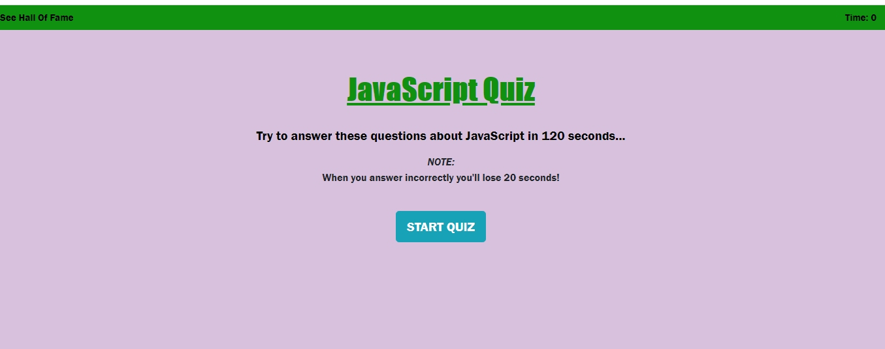
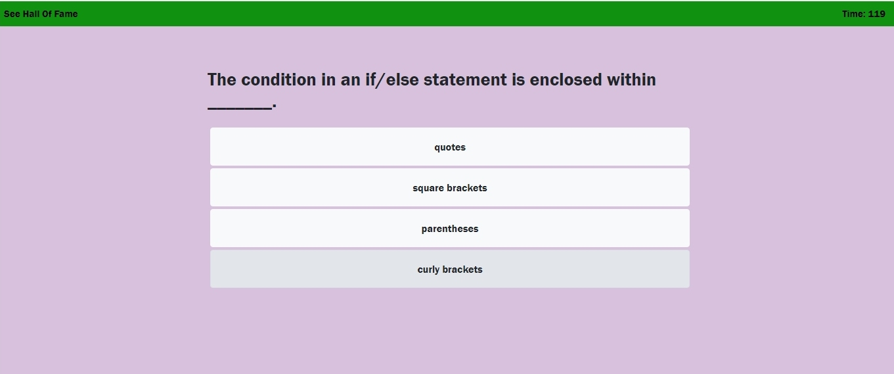
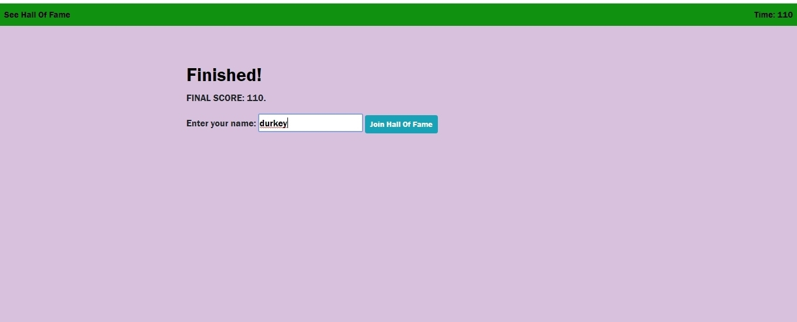

<b>Unit 04 Web APIs Homework: Code Quiz</b>
 
As you proceed in your career as a web developer, you will probably be asked to complete a coding assessment. These assessments are typically a combination of multiple-choice questions and interactive challenges. In this homework assignment, your challenge is to build a code quiz with multiple-choice questions.

<b>Instructions</b>
 
From scratch, build a timer-based quiz application that stores high scores client-side. Following the common templates for user stories, we can frame this challenge as follows: As a coding bootcamp student I want to take a timed quiz on JavaScript fundamentals that stores high scores so that I can gauge my progress compared to my peers. How do you deliver this? 

Here are some guidelines:

The user arrives at the landing page and is presented with a call-to-action to "Start Quiz." Also note the navigation option to "View Highscores" and the "Time" value set at 0.

Clicking the "Start Quiz" button presents the user with a series of questions. The timer is initialized with a value and immediately begins countdown.

Score is calculated by time remaining. Answering quickly and correctly results in a higher score. Answering incorrectly results in a time penalty (20 seconds are subtracted from time remaining).

When time runs out and/or all questions are answered, the user is presented with their final score and asked to enter their initials. Their final score and initials are then stored in localStorage.

Your application should also be responsive, ensuring that it adapts to multiple screen sizes.

<b>Minimum Requirements</b>

-Functional, deployed application.

-GitHub repository with README describing project.

-The first view of the application displays a button that starts the quiz.

-Clicking the start button displays a series of questions.

-Once the quiz begins, a timer starts.

-If a question is answered incorrectly, additional time is subtracted from the timer.

-The timer stops when all questions have been answered or the timer reaches 0.

-After the game ends, the user can save their initials and score to a highscores view using local storage.

<b>Bonus</b>

-Add audio files to alert the user of correct or incorrect answers. Be sure to include the appropriate license.

-Customize the application theme.

-Create multiple quizzes and an option for users to choose between them.

-Add the application to your portfolio.

<b>Screenshots</b>

<i>Start page/landing page: </i>

<i>Quiz in progress: </i>

<i>Finished quiz: </i>

<i>Hall of Fame: </i>

